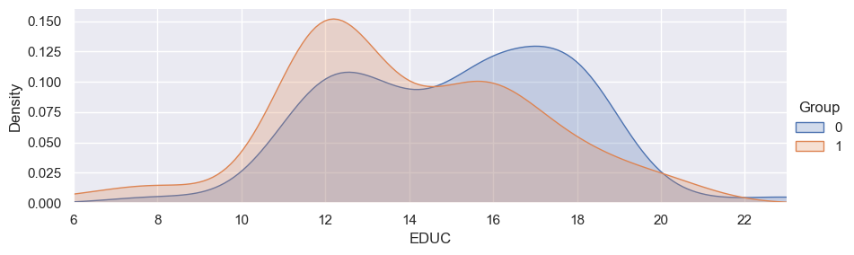

<h1>Deteccion temprana del Alzheimer utilizando datos de Imagenes por resonancia magnética<span class="tocSkip"></span></h1>

<div class="toc"><ul class="toc-item"><li><span><a href="#Definicion-del-problema." data-toc-modified-id="Definicion-del-problema.-1"><span class="toc-item-num">1&nbsp;&nbsp;</span>Definicion del problema.</a></span><ul class="toc-item"><li><span><a href="#Contexto" data-toc-modified-id="Contexto-1.1"><span class="toc-item-num">1.1&nbsp;&nbsp;</span>Contexto</a></span><ul class="toc-item"><li><span><a href="#Oasis" data-toc-modified-id="Oasis-1.1.1"><span class="toc-item-num">1.1.1&nbsp;&nbsp;</span>Oasis</a></span></li><li><span><a href="#Alzheimer" data-toc-modified-id="Alzheimer-1.1.2"><span class="toc-item-num">1.1.2&nbsp;&nbsp;</span>Alzheimer</a></span></li><li><span><a href="#Demencia" data-toc-modified-id="Demencia-1.1.3"><span class="toc-item-num">1.1.3&nbsp;&nbsp;</span>Demencia</a></span></li></ul></li></ul></li><li><span><a href="#Datos" data-toc-modified-id="Datos-2"><span class="toc-item-num">2&nbsp;&nbsp;</span>Datos</a></span><ul class="toc-item"><li><span><a href="#Carga-de-libreria-y-datos" data-toc-modified-id="Carga-de-libreria-y-datos-2.1"><span class="toc-item-num">2.1&nbsp;&nbsp;</span>Carga de libreria y datos</a></span></li></ul></li><li><span><a href="#EDA" data-toc-modified-id="EDA-3"><span class="toc-item-num">3&nbsp;&nbsp;</span>EDA</a></span></li><li><span><a href="#Data-Precrocessing" data-toc-modified-id="Data-Precrocessing-4"><span class="toc-item-num">4&nbsp;&nbsp;</span>Data Precrocessing</a></span><ul class="toc-item"><li><span><a href="#Missing-values" data-toc-modified-id="Missing-values-4.1"><span class="toc-item-num">4.1&nbsp;&nbsp;</span>Missing values</a></span></li><li><span><a href="#Imputation" data-toc-modified-id="Imputation-4.2"><span class="toc-item-num">4.2&nbsp;&nbsp;</span>Imputation</a></span></li><li><span><a href="#Train/Test-sets" data-toc-modified-id="Train/Test-sets-4.3"><span class="toc-item-num">4.3&nbsp;&nbsp;</span>Train/Test sets</a></span></li></ul></li><li><span><a href="#Modelos" data-toc-modified-id="Modelos-5"><span class="toc-item-num">5&nbsp;&nbsp;</span>Modelos</a></span><ul class="toc-item"><li><span><a href="#1.-Linear-Regression" data-toc-modified-id="1.-Linear-Regression-5.1"><span class="toc-item-num">5.1&nbsp;&nbsp;</span>1. Linear Regression</a></span></li><li><span><a href="#2.-Stochastic-Gradient-Descent" data-toc-modified-id="2.-Stochastic-Gradient-Descent-5.2"><span class="toc-item-num">5.2&nbsp;&nbsp;</span>2. Stochastic Gradient Descent</a></span></li><li><span><a href="#3.-Logistic-Regression" data-toc-modified-id="3.-Logistic-Regression-5.3"><span class="toc-item-num">5.3&nbsp;&nbsp;</span>3. Logistic Regression</a></span></li><li><span><a href="#4.-KNN" data-toc-modified-id="4.-KNN-5.4"><span class="toc-item-num">5.4&nbsp;&nbsp;</span>4. KNN</a></span></li><li><span><a href="#5.-Decision-Trees" data-toc-modified-id="5.-Decision-Trees-5.5"><span class="toc-item-num">5.5&nbsp;&nbsp;</span>5. Decision Trees</a></span></li><li><span><a href="#6.-SVM" data-toc-modified-id="6.-SVM-5.6"><span class="toc-item-num">5.6&nbsp;&nbsp;</span>6. SVM</a></span></li><li><span><a href="#7.-k-means-clustering" data-toc-modified-id="7.-k-means-clustering-5.7"><span class="toc-item-num">5.7&nbsp;&nbsp;</span>7. k-means clustering</a></span></li><li><span><a href="#8.-Random-Forest" data-toc-modified-id="8.-Random-Forest-5.8"><span class="toc-item-num">5.8&nbsp;&nbsp;</span>8. Random Forest</a></span></li><li><span><a href="#9.-Naive-Bayes" data-toc-modified-id="9.-Naive-Bayes-5.9"><span class="toc-item-num">5.9&nbsp;&nbsp;</span>9. Naive Bayes</a></span></li></ul></li><li><span><a href="#Evaluación-y-Resultados" data-toc-modified-id="Evaluación-y-Resultados-6"><span class="toc-item-num">6&nbsp;&nbsp;</span>Evaluación y Resultados</a></span><ul class="toc-item"><li><span><a href="#1.-Resultados" data-toc-modified-id="1.-Resultados-6.1"><span class="toc-item-num">6.1&nbsp;&nbsp;</span>1. Resultados</a></span></li></ul></li><li><span><a href="#Conclusiones" data-toc-modified-id="Conclusiones-7"><span class="toc-item-num">7&nbsp;&nbsp;</span>Conclusiones</a></span></li><li><span><a href="#Acknowledgements:" data-toc-modified-id="Acknowledgements:-8"><span class="toc-item-num">8&nbsp;&nbsp;</span>Acknowledgements:</a></span></li></ul></div>

## Definicion del problema.


### Contexto

#### Oasis
**[OASIS](http://www.oasis-brains.org/)** *(Open Access Series of Imaging Studies)* es un proyecto destinado a almacenar y entregar de forma gratuita los datos de las resonancias magnéticas a la comunidad científica. Mediante la recopilacion y distribucion de los datos de MRI, se espera facilitar futuros descubrimientos en el area de la neurociencia. 

#### Alzheimer 

La enfermedad del Alzheimer (AD) es una enfermedad neurodegenerativa que usualmente se presenta de forma lenta y progresiva. Se estima que corresponde a aproximadamente el 60/70% de los casos de demencia. algunos de sus sintomas comunes en etapas tempranas son la *dificultad de recordar eventos recientes*. Con el avance de la enfermedad, se presentan nuevos sintomas como *problemas de lenguaje/comunicacion*, *desorientación*, *cambios de humor*, *perdida de motivacion*, etc. 
A medida que la condición de la persona empeora, esta se aparta de la familia y la sociedad y gradualmente, va perdiendo funciones corporales como por ejemplo movilidad. En última instancia, esta enfermedad y sus sintomas asociados conducen a la muerte. Si bien la progresión puede variar, la expectativa de vida típica después del diagnóstico es de tres a nueve años.

#### Demencia

La demencia no es una enfermedad específica, sino un grupo de trastornos caracterizados por el deterioro de al menos, dos funciones cerebrales como la disminución de la memoria u otras habilidades de pensamiento lo suficientemente graves como para reducir la capacidad de una persona para realizar las actividades cotidianas.


## Datos

Los datos del proyecto se encuentran en su respectiva entrada en **[Kaggle](https://www.kaggle.com/datasets/jboysen/mri-and-alzheimers)** el cual puede ser utilizado para el entrenamiento de varios modelos de **Machine Learning** con la finalidad de identificar o clasificar pacientes con  demencia leve o moderada.

Algunas caracteristicas del DataSet son: 

1. Cross-sectional MRI Data in Young, Middle Aged, Nondemented and Demented Older Adults: 
    
    Este Set de datos presenta una coleccion del tipo cross-sectional de  416 personas entre los 18 a 96 años. Para cada sujeto, se incluyen 3 o 4 exploraciones de MRI del tipo T1 obtenidas una unica sesión de exploración. Los sujetos son todos diestros e incluyen tanto a hombres como a mujeres. 
    
    100 de los sujetos incluidos mayores de 60 años han sido diagnosticados clínicamente con enfermedad de Alzheimer (DA) de muy leve a moderada. Además, se incluye un conjunto de datos de confiabilidad que contiene 20 sujetos sin demencia de los que se tomaron imágenes en una visita posterior dentro de los 90 días de su sesión inicial.
    
    
2. Longitudinal MRI Data in Nondemented and Demented Older Adults:
    Este Set de datos presenta una coleccion del tipo longitudinal de 150 personas entre los 60 a 96 años. Cada sujeto fue escaneado en dos o más visitas, separadas por al menos un año generando un total de 373 sesiones de imágenes. al igual que en el set de datos anterior, se incluyen 3 o 4 exploraciones de MRI del tipo T1 obtenidas una unica sesión de exploración. Los sujetos son todos diestros e incluyen tanto a hombres como a mujeres. 
    
    72 de los sujetos se caracterizaron como no dementes a lo largo del estudio. 64 de los sujetos incluidos se caracterizaron como dementes en el momento de sus visitas iniciales y permanecieron así durante las exploraciones posteriores, incluidas 51 personas con enfermedad de Alzheimer de leve a moderada. Otros 14 sujetos se caracterizaron como no dementes en el momento de su visita inicial y posteriormente se caracterizaron como dementes en una visita posterior.
    
para más informacion ver [MRI Basics](https://case.edu/med/neurology/NR/MRI%20Basics.htm)

### Carga de libreria y datos


```python
# Analisis de datos
import pandas as pd
import numpy as np
import random as rnd

# Visualizacion

import seaborn as sns 
import matplotlib.pyplot as plt
%matplotlib inline 

# Machine learning
from sklearn.linear_model import LogisticRegression
from sklearn.linear_model import LinearRegression
from sklearn.svm import SVC, LinearSVC
from sklearn.ensemble import RandomForestClassifier
from sklearn.neighbors import KNeighborsClassifier
from sklearn.cluster import KMeans
from sklearn.naive_bayes import GaussianNB
from sklearn.linear_model import Perceptron
from sklearn.linear_model import SGDClassifier
from sklearn.tree import DecisionTreeClassifier
from sklearn.metrics import confusion_matrix,classification_report,accuracy_score,plot_confusion_matrix

sns.set()

data_cross = pd.read_csv("C:/Users/Camilo/Notebooks_prueba/Porj1_MDA/Alz/oasis_cross-sectional.csv")
data_long = pd.read_csv("C:/Users/Camilo/Notebooks_prueba/Porj1_MDA/Alz/oasis_longitudinal.csv")
```

Generamos una breve descripcion de las variables


```python
print('--------------DataCross--------------'), data_cross.info(),print('                               '),print('---------------DataLong--------------'), data_long.info()
```

    --------------DataCross--------------
    <class 'pandas.core.frame.DataFrame'>
    RangeIndex: 436 entries, 0 to 435
    Data columns (total 12 columns):
     #   Column  Non-Null Count  Dtype  
    ---  ------  --------------  -----  
     0   ID      436 non-null    object 
     1   M/F     436 non-null    object 
     2   Hand    436 non-null    object 
     3   Age     436 non-null    int64  
     4   Educ    235 non-null    float64
     5   SES     216 non-null    float64
     6   MMSE    235 non-null    float64
     7   CDR     235 non-null    float64
     8   eTIV    436 non-null    int64  
     9   nWBV    436 non-null    float64
     10  ASF     436 non-null    float64
     11  Delay   20 non-null     float64
    dtypes: float64(7), int64(2), object(3)
    memory usage: 41.0+ KB
                                   
    ---------------DataLong--------------
    <class 'pandas.core.frame.DataFrame'>
    RangeIndex: 373 entries, 0 to 372
    Data columns (total 15 columns):
     #   Column      Non-Null Count  Dtype  
    ---  ------      --------------  -----  
     0   Subject ID  373 non-null    object 
     1   MRI ID      373 non-null    object 
     2   Group       373 non-null    object 
     3   Visit       373 non-null    int64  
     4   MR Delay    373 non-null    int64  
     5   M/F         373 non-null    object 
     6   Hand        373 non-null    object 
     7   Age         373 non-null    int64  
     8   EDUC        373 non-null    int64  
     9   SES         354 non-null    float64
     10  MMSE        371 non-null    float64
     11  CDR         373 non-null    float64
     12  eTIV        373 non-null    int64  
     13  nWBV        373 non-null    float64
     14  ASF         373 non-null    float64
    dtypes: float64(5), int64(5), object(5)
    memory usage: 43.8+ KB
    


    (None, None, None, None, None)


Donde podemos definir ciertas variables como:

|COL  |Definicion                       |
|-----|------------------------------------|
|EDUC |Años de estudio                  |
|SES  |Status socioeconomico                |
|MMSE |[Mini examen del estado mental](https://www.farmaceuticoscomunitarios.org/anexos/vol11_n1/ANEXO2.pdf)       |
|CDR  |[Rating de demencia clinica](https://www.hipocampo.org/hughes.asp)            |
|eTIV |[Volumen intracraneal total estimado](https://link.springer.com/article/10.1007/s12021-015-9266-5) |
|nWBV |[Volumen normalizado total del cerebro](https://www.ncbi.nlm.nih.gov/pubmed/11547042)        |
|ASF  |[Factor de escala Atlas](http://www.sciencedirect.com/science/article/pii/S1053811904003271)               


Dada las caracteristicas del DataSet *Data_long*, se selecciona este como el set de entrenamiento por lo tanto se procede con el EDA.


## EDA

Echamos un vistazo previo a como se presentan los datos.


```python
data_long.head()
```


<div>
<style scoped>
    .dataframe tbody tr th:only-of-type {
        vertical-align: middle;
    }

    .dataframe tbody tr th {
        vertical-align: top;
    }

    .dataframe thead th {
        text-align: right;
    }
</style>
<table border="1" class="dataframe">
  <thead>
    <tr style="text-align: right;">
      <th></th>
      <th>Subject ID</th>
      <th>MRI ID</th>
      <th>Group</th>
      <th>Visit</th>
      <th>MR Delay</th>
      <th>M/F</th>
      <th>Hand</th>
      <th>Age</th>
      <th>EDUC</th>
      <th>SES</th>
      <th>MMSE</th>
      <th>CDR</th>
      <th>eTIV</th>
      <th>nWBV</th>
      <th>ASF</th>
    </tr>
  </thead>
  <tbody>
    <tr>
      <th>0</th>
      <td>OAS2_0001</td>
      <td>OAS2_0001_MR1</td>
      <td>Nondemented</td>
      <td>1</td>
      <td>0</td>
      <td>M</td>
      <td>R</td>
      <td>87</td>
      <td>14</td>
      <td>2.0</td>
      <td>27.0</td>
      <td>0.0</td>
      <td>1987</td>
      <td>0.696</td>
      <td>0.883</td>
    </tr>
    <tr>
      <th>1</th>
      <td>OAS2_0001</td>
      <td>OAS2_0001_MR2</td>
      <td>Nondemented</td>
      <td>2</td>
      <td>457</td>
      <td>M</td>
      <td>R</td>
      <td>88</td>
      <td>14</td>
      <td>2.0</td>
      <td>30.0</td>
      <td>0.0</td>
      <td>2004</td>
      <td>0.681</td>
      <td>0.876</td>
    </tr>
    <tr>
      <th>2</th>
      <td>OAS2_0002</td>
      <td>OAS2_0002_MR1</td>
      <td>Demented</td>
      <td>1</td>
      <td>0</td>
      <td>M</td>
      <td>R</td>
      <td>75</td>
      <td>12</td>
      <td>NaN</td>
      <td>23.0</td>
      <td>0.5</td>
      <td>1678</td>
      <td>0.736</td>
      <td>1.046</td>
    </tr>
    <tr>
      <th>3</th>
      <td>OAS2_0002</td>
      <td>OAS2_0002_MR2</td>
      <td>Demented</td>
      <td>2</td>
      <td>560</td>
      <td>M</td>
      <td>R</td>
      <td>76</td>
      <td>12</td>
      <td>NaN</td>
      <td>28.0</td>
      <td>0.5</td>
      <td>1738</td>
      <td>0.713</td>
      <td>1.010</td>
    </tr>
    <tr>
      <th>4</th>
      <td>OAS2_0002</td>
      <td>OAS2_0002_MR3</td>
      <td>Demented</td>
      <td>3</td>
      <td>1895</td>
      <td>M</td>
      <td>R</td>
      <td>80</td>
      <td>12</td>
      <td>NaN</td>
      <td>22.0</td>
      <td>0.5</td>
      <td>1698</td>
      <td>0.701</td>
      <td>1.034</td>
    </tr>
  </tbody>
</table>
</div>


Generamos algunas medidas de tendencia para ver como se distribuyen las variables.


```python
data_long.describe()
```


<div>
<style scoped>
    .dataframe tbody tr th:only-of-type {
        vertical-align: middle;
    }

    .dataframe tbody tr th {
        vertical-align: top;
    }

    .dataframe thead th {
        text-align: right;
    }
</style>
<table border="1" class="dataframe">
  <thead>
    <tr style="text-align: right;">
      <th></th>
      <th>Visit</th>
      <th>MR Delay</th>
      <th>Age</th>
      <th>EDUC</th>
      <th>SES</th>
      <th>MMSE</th>
      <th>CDR</th>
      <th>eTIV</th>
      <th>nWBV</th>
      <th>ASF</th>
    </tr>
  </thead>
  <tbody>
    <tr>
      <th>count</th>
      <td>373.000000</td>
      <td>373.000000</td>
      <td>373.000000</td>
      <td>373.000000</td>
      <td>354.000000</td>
      <td>371.000000</td>
      <td>373.000000</td>
      <td>373.000000</td>
      <td>373.000000</td>
      <td>373.000000</td>
    </tr>
    <tr>
      <th>mean</th>
      <td>1.882038</td>
      <td>595.104558</td>
      <td>77.013405</td>
      <td>14.597855</td>
      <td>2.460452</td>
      <td>27.342318</td>
      <td>0.290885</td>
      <td>1488.128686</td>
      <td>0.729568</td>
      <td>1.195461</td>
    </tr>
    <tr>
      <th>std</th>
      <td>0.922843</td>
      <td>635.485118</td>
      <td>7.640957</td>
      <td>2.876339</td>
      <td>1.134005</td>
      <td>3.683244</td>
      <td>0.374557</td>
      <td>176.139286</td>
      <td>0.037135</td>
      <td>0.138092</td>
    </tr>
    <tr>
      <th>min</th>
      <td>1.000000</td>
      <td>0.000000</td>
      <td>60.000000</td>
      <td>6.000000</td>
      <td>1.000000</td>
      <td>4.000000</td>
      <td>0.000000</td>
      <td>1106.000000</td>
      <td>0.644000</td>
      <td>0.876000</td>
    </tr>
    <tr>
      <th>25%</th>
      <td>1.000000</td>
      <td>0.000000</td>
      <td>71.000000</td>
      <td>12.000000</td>
      <td>2.000000</td>
      <td>27.000000</td>
      <td>0.000000</td>
      <td>1357.000000</td>
      <td>0.700000</td>
      <td>1.099000</td>
    </tr>
    <tr>
      <th>50%</th>
      <td>2.000000</td>
      <td>552.000000</td>
      <td>77.000000</td>
      <td>15.000000</td>
      <td>2.000000</td>
      <td>29.000000</td>
      <td>0.000000</td>
      <td>1470.000000</td>
      <td>0.729000</td>
      <td>1.194000</td>
    </tr>
    <tr>
      <th>75%</th>
      <td>2.000000</td>
      <td>873.000000</td>
      <td>82.000000</td>
      <td>16.000000</td>
      <td>3.000000</td>
      <td>30.000000</td>
      <td>0.500000</td>
      <td>1597.000000</td>
      <td>0.756000</td>
      <td>1.293000</td>
    </tr>
    <tr>
      <th>max</th>
      <td>5.000000</td>
      <td>2639.000000</td>
      <td>98.000000</td>
      <td>23.000000</td>
      <td>5.000000</td>
      <td>30.000000</td>
      <td>2.000000</td>
      <td>2004.000000</td>
      <td>0.837000</td>
      <td>1.587000</td>
    </tr>
  </tbody>
</table>
</div>


Comenzamos a definir nuestra variable de interes o target, y analizamos su composicion según el sexo.


```python
data_long = data_long.loc[data_long['Visit']==1] # utilizamos los datos de las primeras visitas
data_long = data_long.reset_index(drop=True) # reiniciamos los indices despues del filtro anterior
data_long['Group'] = data_long['Group'].replace(['Converted'], ['Demented']) # Definimos los Target
data_long['Group'] = data_long['Group'].replace(['Demented', 'Nondemented'], [1,0]) # Variables objetivo
```


```python
# Funcion para el grafico de barras deseado
def bar_chart(feature):
    Demented = data_long[data_long['Group']==1][feature].value_counts()
    Nondemented = data_long[data_long['Group']==0][feature].value_counts()
    df_bar = pd.DataFrame([Demented,Nondemented])
    df_bar.index = ['Demented','Nondemented']
    df_bar.plot(kind='bar',stacked=True, figsize=(8,5))
```


```python
# Grafico Group vs Sexo 
bar_chart('M/F')
plt.xlabel('Group')
plt.ylabel('Number of patients')
plt.legend()
plt.title('Gender and Demented rate')
```


    Text(0.5, 1.0, 'Gender and Demented rate')


    

    


De este grafico se observa una inclinacion hacia los hombres de presentar algun tipo de demencia (Segun lo observado en Nondemented). Posteriormente, se procede a analizar lo expuesto en la variable MMSE, donde se define Nondemented = 0, Demented =1


```python
facet= sns.FacetGrid(data_long,hue="Group", aspect=3)
facet.map(sns.kdeplot,'MMSE',shade= True)
facet.set(xlim=(0, data_long['MMSE'].max()))
facet.add_legend()
plt.xlim(15.30)
```


    (15.3, 30.0)


    

    


Esta grafica, nos expone que el rango de puntuacion de MMSE es mayor en las personas dementes,  por otro lado los no dementes presentan unos valores mayores presentando un rango de 25 a 30. Posteriormente se procede a analizar la informacion de ASF, eTIV y nWBV que estan relacionados al volumen del cerebro.


```python
#ASF
facet= sns.FacetGrid(data_long,hue="Group", aspect=3)
facet.map(sns.kdeplot,'ASF',shade= True)
facet.set(xlim=(0, data_long['ASF'].max()))
facet.add_legend()
plt.xlim(0.5, 2)

#eTIV 
facet= sns.FacetGrid(data_long,hue="Group", aspect=3)
facet.map(sns.kdeplot,'eTIV',shade= True)
facet.set(xlim=(0, data_long['eTIV'].max()))
facet.add_legend()
plt.xlim(900, 2100)

#nWBV
facet= sns.FacetGrid(data_long,hue="Group", aspect=3)
facet.map(sns.kdeplot,'nWBV',shade= True)
facet.set(xlim=(0, data_long['nWBV'].max()))
facet.add_legend()
plt.xlim(0.6,0.9)
```


    (0.6, 0.9)


    

    


    

    


    

    


De los graficos, tal como se esperaba las personas no dementes presentan un volumen cerebral mayor, esto se debe a que tal como se define en un inicio la enfermedad afecta el cerebro encogiendo su tejido. Posteriormente se trata de identificar alguna información valiosa en los datos de interés segun la edad.


```python
#AGE
facet= sns.FacetGrid(data_long,hue="Group", aspect=3)
facet.map(sns.kdeplot,'Age',shade= True)
facet.set(xlim=(0, data_long['Age'].max()))
facet.add_legend()
plt.xlim(50,100)
```


    (50.0, 100.0)


    

    


Se observa una concentracion mayor en los usuarios que presentan la enfermedad, siendo su concentracion entre los 70-80 años. Una explicación de esto puede ser a que los usuarios dementes presentan una esperanza de vida menor. Finalmente se analizan los datos de años de educación vs datos de interes.


```python
# EDUC
facet= sns.FacetGrid(data_long,hue="Group", aspect=3)
facet.map(sns.kdeplot,'EDUC',shade= True)
facet.set(xlim=(data_long['EDUC'].min(), data_long['EDUC'].max()))
facet.add_legend()
plt.ylim(0, 0.16)
```


    (0.0, 0.16)


    

    


Donde no se observa realmente una relacion tan evidente.

## Data Precrocessing

### Missing values


```python
# Generamos un sumario de las columnas y sus datos nulos
pd.isnull(data_long).sum()
```


    Subject ID    0
    MRI ID        0
    Group         0
    Visit         0
    MR Delay      0
    M/F           0
    Hand          0
    Age           0
    EDUC          0
    SES           8
    MMSE          0
    CDR           0
    eTIV          0
    nWBV          0
    ASF           0
    dtype: int64


```python
data_long['Group'].value_counts()
```


    1    78
    0    72
    Name: Group, dtype: int64


### Imputation

Anteriormente ya imputamos ciertos valores a nuestras variables, solo nos faltaría imputar los valores a la variable M/F 


```python
# Estandarizamos/imputamos los valores de edad a M = 0 y F = 1
data_long['M/F'] = data_long['M/F'].map({'F':1, 'M':0}).astype(int)
data_long.head()
```


<div>
<style scoped>
    .dataframe tbody tr th:only-of-type {
        vertical-align: middle;
    }

    .dataframe tbody tr th {
        vertical-align: top;
    }

    .dataframe thead th {
        text-align: right;
    }
</style>
<table border="1" class="dataframe">
  <thead>
    <tr style="text-align: right;">
      <th></th>
      <th>Subject ID</th>
      <th>MRI ID</th>
      <th>Group</th>
      <th>Visit</th>
      <th>MR Delay</th>
      <th>M/F</th>
      <th>Hand</th>
      <th>Age</th>
      <th>EDUC</th>
      <th>SES</th>
      <th>MMSE</th>
      <th>CDR</th>
      <th>eTIV</th>
      <th>nWBV</th>
      <th>ASF</th>
    </tr>
  </thead>
  <tbody>
    <tr>
      <th>0</th>
      <td>OAS2_0001</td>
      <td>OAS2_0001_MR1</td>
      <td>0</td>
      <td>1</td>
      <td>0</td>
      <td>0</td>
      <td>R</td>
      <td>87</td>
      <td>14</td>
      <td>2.0</td>
      <td>27.0</td>
      <td>0.0</td>
      <td>1987</td>
      <td>0.696</td>
      <td>0.883</td>
    </tr>
    <tr>
      <th>1</th>
      <td>OAS2_0002</td>
      <td>OAS2_0002_MR1</td>
      <td>1</td>
      <td>1</td>
      <td>0</td>
      <td>0</td>
      <td>R</td>
      <td>75</td>
      <td>12</td>
      <td>NaN</td>
      <td>23.0</td>
      <td>0.5</td>
      <td>1678</td>
      <td>0.736</td>
      <td>1.046</td>
    </tr>
    <tr>
      <th>2</th>
      <td>OAS2_0004</td>
      <td>OAS2_0004_MR1</td>
      <td>0</td>
      <td>1</td>
      <td>0</td>
      <td>1</td>
      <td>R</td>
      <td>88</td>
      <td>18</td>
      <td>3.0</td>
      <td>28.0</td>
      <td>0.0</td>
      <td>1215</td>
      <td>0.710</td>
      <td>1.444</td>
    </tr>
    <tr>
      <th>3</th>
      <td>OAS2_0005</td>
      <td>OAS2_0005_MR1</td>
      <td>0</td>
      <td>1</td>
      <td>0</td>
      <td>0</td>
      <td>R</td>
      <td>80</td>
      <td>12</td>
      <td>4.0</td>
      <td>28.0</td>
      <td>0.0</td>
      <td>1689</td>
      <td>0.712</td>
      <td>1.039</td>
    </tr>
    <tr>
      <th>4</th>
      <td>OAS2_0007</td>
      <td>OAS2_0007_MR1</td>
      <td>1</td>
      <td>1</td>
      <td>0</td>
      <td>0</td>
      <td>R</td>
      <td>71</td>
      <td>16</td>
      <td>NaN</td>
      <td>28.0</td>
      <td>0.5</td>
      <td>1357</td>
      <td>0.748</td>
      <td>1.293</td>
    </tr>
  </tbody>
</table>
</div>


Dado que la variable SES es del tipo discreta, debemos realizar una imputacion sobre esta; para hacerlo más interesante se hará de forma manual en base a la mediana de los datos, en vez de utilizar los metodos automatizados que nos entrega Sklearn.

Para este punto analizaremos dos variables que comunmente presentan una correlacion como lo son el nivel socioeconomico y los años de estudio.


```python
# EDUC SES
x = data_long['EDUC']
y = data_long['SES']

ses_not_null_index = y[~y.isnull()].index
x = x[ses_not_null_index]
y = y[ses_not_null_index]

# Realizamos el grafico
z = np.polyfit(x, y, 1)
p = np.poly1d(z)
plt.plot(x, y, 'go', x, p(x), "r--") # Linea de tendencia en rojo
plt.xlabel('Education Level(EDUC)')
plt.ylabel('Social Economic Status(SES)')

plt.show()
```


    

    


```python
# Generamos una lista de medianas segun años de educación
data_long.groupby(['EDUC'])['SES'].median()
```


    EDUC
    6     4.0
    8     5.0
    11    4.0
    12    3.0
    13    2.0
    14    3.0
    15    2.0
    16    2.0
    17    1.0
    18    2.0
    20    1.0
    23    1.0
    Name: SES, dtype: float64


```python
# Reemplazamos los datos faltantes vistos en el punto anterior
data_long["SES"].fillna(data_long.groupby("EDUC")["SES"].transform("median"), inplace=True)
data_long.info() # imprimimos la informacion de los datos.
```

    <class 'pandas.core.frame.DataFrame'>
    RangeIndex: 150 entries, 0 to 149
    Data columns (total 15 columns):
     #   Column      Non-Null Count  Dtype  
    ---  ------      --------------  -----  
     0   Subject ID  150 non-null    object 
     1   MRI ID      150 non-null    object 
     2   Group       150 non-null    int64  
     3   Visit       150 non-null    int64  
     4   MR Delay    150 non-null    int64  
     5   M/F         150 non-null    int32  
     6   Hand        150 non-null    object 
     7   Age         150 non-null    int64  
     8   EDUC        150 non-null    int64  
     9   SES         150 non-null    float64
     10  MMSE        150 non-null    float64
     11  CDR         150 non-null    float64
     12  eTIV        150 non-null    int64  
     13  nWBV        150 non-null    float64
     14  ASF         150 non-null    float64
    dtypes: float64(5), int32(1), int64(6), object(3)
    memory usage: 17.1+ KB
    

### Train/Test sets


```python
# Eliminamos las variables innecesarias de ambos DataSet
data_cross.drop(columns=['Delay', 'Hand'],inplace=True)
data_long = data_long.rename(columns={'EDUC':'Educ'}) #Esto por las diferencias de nombre entre ambos DataSets
data_long = data_long.drop(['Subject ID','MRI ID', 'Visit', 'Hand'], axis=1) # Aplicamos drop a las variables innecesarias
```

Por lo tanto quedamos con las siguientes variables para cada caso.


```python
data_long.head(3)
```


<div>
<style scoped>
    .dataframe tbody tr th:only-of-type {
        vertical-align: middle;
    }

    .dataframe tbody tr th {
        vertical-align: top;
    }

    .dataframe thead th {
        text-align: right;
    }
</style>
<table border="1" class="dataframe">
  <thead>
    <tr style="text-align: right;">
      <th></th>
      <th>Group</th>
      <th>MR Delay</th>
      <th>M/F</th>
      <th>Age</th>
      <th>Educ</th>
      <th>SES</th>
      <th>MMSE</th>
      <th>CDR</th>
      <th>eTIV</th>
      <th>nWBV</th>
      <th>ASF</th>
    </tr>
  </thead>
  <tbody>
    <tr>
      <th>0</th>
      <td>0</td>
      <td>0</td>
      <td>0</td>
      <td>87</td>
      <td>14</td>
      <td>2.0</td>
      <td>27.0</td>
      <td>0.0</td>
      <td>1987</td>
      <td>0.696</td>
      <td>0.883</td>
    </tr>
    <tr>
      <th>1</th>
      <td>1</td>
      <td>0</td>
      <td>0</td>
      <td>75</td>
      <td>12</td>
      <td>3.0</td>
      <td>23.0</td>
      <td>0.5</td>
      <td>1678</td>
      <td>0.736</td>
      <td>1.046</td>
    </tr>
    <tr>
      <th>2</th>
      <td>0</td>
      <td>0</td>
      <td>1</td>
      <td>88</td>
      <td>18</td>
      <td>3.0</td>
      <td>28.0</td>
      <td>0.0</td>
      <td>1215</td>
      <td>0.710</td>
      <td>1.444</td>
    </tr>
  </tbody>
</table>
</div>


```python
data_cross.head(3)
```


<div>
<style scoped>
    .dataframe tbody tr th:only-of-type {
        vertical-align: middle;
    }

    .dataframe tbody tr th {
        vertical-align: top;
    }

    .dataframe thead th {
        text-align: right;
    }
</style>
<table border="1" class="dataframe">
  <thead>
    <tr style="text-align: right;">
      <th></th>
      <th>ID</th>
      <th>M/F</th>
      <th>Age</th>
      <th>Educ</th>
      <th>SES</th>
      <th>MMSE</th>
      <th>CDR</th>
      <th>eTIV</th>
      <th>nWBV</th>
      <th>ASF</th>
    </tr>
  </thead>
  <tbody>
    <tr>
      <th>0</th>
      <td>OAS1_0001_MR1</td>
      <td>F</td>
      <td>74</td>
      <td>2.0</td>
      <td>3.0</td>
      <td>29.0</td>
      <td>0.0</td>
      <td>1344</td>
      <td>0.743</td>
      <td>1.306</td>
    </tr>
    <tr>
      <th>1</th>
      <td>OAS1_0002_MR1</td>
      <td>F</td>
      <td>55</td>
      <td>4.0</td>
      <td>1.0</td>
      <td>29.0</td>
      <td>0.0</td>
      <td>1147</td>
      <td>0.810</td>
      <td>1.531</td>
    </tr>
    <tr>
      <th>2</th>
      <td>OAS1_0003_MR1</td>
      <td>F</td>
      <td>73</td>
      <td>4.0</td>
      <td>3.0</td>
      <td>27.0</td>
      <td>0.5</td>
      <td>1454</td>
      <td>0.708</td>
      <td>1.207</td>
    </tr>
  </tbody>
</table>
</div>


De los datos que utilizaremos para el entrenamiento podemos obtener su matriz de correlacion, quedando:


```python
corr = data_long.corr()
fig, ax = plt.subplots(figsize = (15, 15))
sns.heatmap(corr, cmap='coolwarm_r', annot_kws={'size':20}, annot=True)
```


    <AxesSubplot:>


    

    


Donde se observa que la variable MR Delay no presenta correlacion con el resto de variables, por lo tanto puede ser eliminada.


```python
data_long = data_long.drop(['MR Delay',], axis=1) # eliminamos variable MR Delay
```

Finalmente, definimos nuestras variables como:


```python
# Variable dependiente
Y_train = data_long['Group']

# preprocesamiento de variables independientes
features = ['M/F','Age', 'SES','MMSE', 'eTIV', 'nWBV', 'ASF']
X_train= data_long[features]

print(Y_train.shape, X_train.shape)
```

    (150,) (150, 7)
    

Realizamos el mismo trabajo sobre el set de testeo


```python
# trabajos sobre el test
data_cross['M/F'] = data_cross['M/F'].map({'F':1, 'M':0}).astype(int)
data_cross.info()

```

    <class 'pandas.core.frame.DataFrame'>
    RangeIndex: 436 entries, 0 to 435
    Data columns (total 10 columns):
     #   Column  Non-Null Count  Dtype  
    ---  ------  --------------  -----  
     0   ID      436 non-null    object 
     1   M/F     436 non-null    int32  
     2   Age     436 non-null    int64  
     3   Educ    235 non-null    float64
     4   SES     216 non-null    float64
     5   MMSE    235 non-null    float64
     6   CDR     235 non-null    float64
     7   eTIV    436 non-null    int64  
     8   nWBV    436 non-null    float64
     9   ASF     436 non-null    float64
    dtypes: float64(6), int32(1), int64(2), object(1)
    memory usage: 32.5+ KB
    

Vemos que presenta un gran numero de valores faltantes. Dado que esto molesta a nuestros modelos, debemos decidir con que los reemplazamos. Al ser datos tan sensibles; se elige eliminar estos valores faltantes quedando.


```python
df = data_cross.dropna(axis=0, how='any')
pd.isnull(df).sum()
```


    ID      0
    M/F     0
    Age     0
    Educ    0
    SES     0
    MMSE    0
    CDR     0
    eTIV    0
    nWBV    0
    ASF     0
    dtype: int64


```python
X_test = df[features]
X_test.info()
```

    <class 'pandas.core.frame.DataFrame'>
    Int64Index: 216 entries, 0 to 415
    Data columns (total 7 columns):
     #   Column  Non-Null Count  Dtype  
    ---  ------  --------------  -----  
     0   M/F     216 non-null    int32  
     1   Age     216 non-null    int64  
     2   SES     216 non-null    float64
     3   MMSE    216 non-null    float64
     4   eTIV    216 non-null    int64  
     5   nWBV    216 non-null    float64
     6   ASF     216 non-null    float64
    dtypes: float64(4), int32(1), int64(2)
    memory usage: 12.7 KB
    

**Dado que el indicador CDR es una medición directa del estado mental del paciente, no se contempla este parámetro para la realizacion de los modelos (dado que se pretende predecir justamente un estado directamente relacionado a este indicador.)**

## Modelos


```python
def conf_mat_acc(modelo):
    disp = plot_confusion_matrix(modelo, X_train, Y_train,
                        cmap=plt.cm.Blues, values_format="d")
    true_pred = disp.confusion_matrix[0,0]+disp.confusion_matrix[1,1]
    total_data = np.sum(disp.confusion_matrix)
    accuracy = true_pred/total_data
    print('accuracy: ', np.round(accuracy, 2))
    plt.show()
```

### 1. Linear Regression

Para el set de datos imputado


```python
linreg = LinearRegression()
linreg.fit(X_train, Y_train)
Y_pred = linreg.predict(X_test)
acc_linreg = round(linreg.score(X_train, Y_train) * 100, 2)
acc_linreg
```


    32.84


### 2. Stochastic Gradient Descent


```python
sgd = SGDClassifier()
sgd.fit(X_train, Y_train)

Y_pred = sgd.predict(X_test)
acc_sgd = round(sgd.score(X_train, Y_train) * 100, 2)
acc_sgd
```


    52.0


```python
conf_mat_acc(sgd)
```

    accuracy:  0.52
    

    c:\Users\Camilo\anaconda3\envs\Proj1_MDA\lib\site-packages\sklearn\utils\deprecation.py:87: FutureWarning: Function plot_confusion_matrix is deprecated; Function `plot_confusion_matrix` is deprecated in 1.0 and will be removed in 1.2. Use one of the class methods: ConfusionMatrixDisplay.from_predictions or ConfusionMatrixDisplay.from_estimator.
      warnings.warn(msg, category=FutureWarning)
    


    

    


### 3. Logistic Regression


```python
logreg = LogisticRegression()
logreg.fit(X_train, Y_train)

Y_pred = logreg.predict(X_test)
acc_log = round(logreg.score(X_train, Y_train) * 100, 2)
acc_log
```

    c:\Users\Camilo\anaconda3\envs\Proj1_MDA\lib\site-packages\sklearn\linear_model\_logistic.py:444: ConvergenceWarning: lbfgs failed to converge (status=1):
    STOP: TOTAL NO. of ITERATIONS REACHED LIMIT.
    
    Increase the number of iterations (max_iter) or scale the data as shown in:
        https://scikit-learn.org/stable/modules/preprocessing.html
    Please also refer to the documentation for alternative solver options:
        https://scikit-learn.org/stable/modules/linear_model.html#logistic-regression
      n_iter_i = _check_optimize_result(
    


    75.33


```python
conf_mat_acc(logreg)
```

    c:\Users\Camilo\anaconda3\envs\Proj1_MDA\lib\site-packages\sklearn\utils\deprecation.py:87: FutureWarning: Function plot_confusion_matrix is deprecated; Function `plot_confusion_matrix` is deprecated in 1.0 and will be removed in 1.2. Use one of the class methods: ConfusionMatrixDisplay.from_predictions or ConfusionMatrixDisplay.from_estimator.
      warnings.warn(msg, category=FutureWarning)
    

    accuracy:  0.75
    


    

    


### 4. KNN


```python
knn = KNeighborsClassifier()
knn.fit(X_train,Y_train)

Y_pred = knn.predict(X_test)

acc_knn = round(knn.score(X_train, Y_train) * 100, 2)
acc_knn
```


    70.0


```python
conf_mat_acc(knn)
```

    accuracy:  0.7
    

    c:\Users\Camilo\anaconda3\envs\Proj1_MDA\lib\site-packages\sklearn\utils\deprecation.py:87: FutureWarning: Function plot_confusion_matrix is deprecated; Function `plot_confusion_matrix` is deprecated in 1.0 and will be removed in 1.2. Use one of the class methods: ConfusionMatrixDisplay.from_predictions or ConfusionMatrixDisplay.from_estimator.
      warnings.warn(msg, category=FutureWarning)
    


    

    


### 5. Decision Trees


```python
decision_tree = DecisionTreeClassifier()
decision_tree.fit(X_train, Y_train)

Y_pred = decision_tree.predict(X_test)
Y_pred_dt = Y_pred
acc_decision_tree = round(decision_tree.score(X_train, Y_train) * 100, 2)
acc_decision_tree
```


    100.0


```python
conf_mat_acc(decision_tree)
```

    accuracy:  1.0
    

    c:\Users\Camilo\anaconda3\envs\Proj1_MDA\lib\site-packages\sklearn\utils\deprecation.py:87: FutureWarning: Function plot_confusion_matrix is deprecated; Function `plot_confusion_matrix` is deprecated in 1.0 and will be removed in 1.2. Use one of the class methods: ConfusionMatrixDisplay.from_predictions or ConfusionMatrixDisplay.from_estimator.
      warnings.warn(msg, category=FutureWarning)
    


    

    


### 6. SVM


```python
svm = SVC()
svm.fit(X_train,Y_train)

Y_pred = svm.predict(X_test)

acc_svc = round(svm.score(X_train, Y_train) * 100, 2)
acc_svc
```


    52.0


```python
conf_mat_acc(svm)
```

    accuracy:  0.52
    

    c:\Users\Camilo\anaconda3\envs\Proj1_MDA\lib\site-packages\sklearn\utils\deprecation.py:87: FutureWarning: Function plot_confusion_matrix is deprecated; Function `plot_confusion_matrix` is deprecated in 1.0 and will be removed in 1.2. Use one of the class methods: ConfusionMatrixDisplay.from_predictions or ConfusionMatrixDisplay.from_estimator.
      warnings.warn(msg, category=FutureWarning)
    


    

    


### 7. k-means clustering


```python
Nc = range(1, 20)
kmeans = [KMeans(n_clusters=i) for i in Nc]
score = [kmeans[i].fit(X_train).score(X_train) for i in range(len(kmeans))]
```

    c:\Users\Camilo\anaconda3\envs\Proj1_MDA\lib\site-packages\sklearn\cluster\_kmeans.py:1334: UserWarning: KMeans is known to have a memory leak on Windows with MKL, when there are less chunks than available threads. You can avoid it by setting the environment variable OMP_NUM_THREADS=1.
      warnings.warn(
    c:\Users\Camilo\anaconda3\envs\Proj1_MDA\lib\site-packages\sklearn\cluster\_kmeans.py:1334: UserWarning: KMeans is known to have a memory leak on Windows with MKL, when there are less chunks than available threads. You can avoid it by setting the environment variable OMP_NUM_THREADS=1.
      warnings.warn(
    c:\Users\Camilo\anaconda3\envs\Proj1_MDA\lib\site-packages\sklearn\cluster\_kmeans.py:1334: UserWarning: KMeans is known to have a memory leak on Windows with MKL, when there are less chunks than available threads. You can avoid it by setting the environment variable OMP_NUM_THREADS=1.
      warnings.warn(
    c:\Users\Camilo\anaconda3\envs\Proj1_MDA\lib\site-packages\sklearn\cluster\_kmeans.py:1334: UserWarning: KMeans is known to have a memory leak on Windows with MKL, when there are less chunks than available threads. You can avoid it by setting the environment variable OMP_NUM_THREADS=1.
      warnings.warn(
    c:\Users\Camilo\anaconda3\envs\Proj1_MDA\lib\site-packages\sklearn\cluster\_kmeans.py:1334: UserWarning: KMeans is known to have a memory leak on Windows with MKL, when there are less chunks than available threads. You can avoid it by setting the environment variable OMP_NUM_THREADS=1.
      warnings.warn(
    c:\Users\Camilo\anaconda3\envs\Proj1_MDA\lib\site-packages\sklearn\cluster\_kmeans.py:1334: UserWarning: KMeans is known to have a memory leak on Windows with MKL, when there are less chunks than available threads. You can avoid it by setting the environment variable OMP_NUM_THREADS=1.
      warnings.warn(
    c:\Users\Camilo\anaconda3\envs\Proj1_MDA\lib\site-packages\sklearn\cluster\_kmeans.py:1334: UserWarning: KMeans is known to have a memory leak on Windows with MKL, when there are less chunks than available threads. You can avoid it by setting the environment variable OMP_NUM_THREADS=1.
      warnings.warn(
    c:\Users\Camilo\anaconda3\envs\Proj1_MDA\lib\site-packages\sklearn\cluster\_kmeans.py:1334: UserWarning: KMeans is known to have a memory leak on Windows with MKL, when there are less chunks than available threads. You can avoid it by setting the environment variable OMP_NUM_THREADS=1.
      warnings.warn(
    c:\Users\Camilo\anaconda3\envs\Proj1_MDA\lib\site-packages\sklearn\cluster\_kmeans.py:1334: UserWarning: KMeans is known to have a memory leak on Windows with MKL, when there are less chunks than available threads. You can avoid it by setting the environment variable OMP_NUM_THREADS=1.
      warnings.warn(
    c:\Users\Camilo\anaconda3\envs\Proj1_MDA\lib\site-packages\sklearn\cluster\_kmeans.py:1334: UserWarning: KMeans is known to have a memory leak on Windows with MKL, when there are less chunks than available threads. You can avoid it by setting the environment variable OMP_NUM_THREADS=1.
      warnings.warn(
    c:\Users\Camilo\anaconda3\envs\Proj1_MDA\lib\site-packages\sklearn\cluster\_kmeans.py:1334: UserWarning: KMeans is known to have a memory leak on Windows with MKL, when there are less chunks than available threads. You can avoid it by setting the environment variable OMP_NUM_THREADS=1.
      warnings.warn(
    c:\Users\Camilo\anaconda3\envs\Proj1_MDA\lib\site-packages\sklearn\cluster\_kmeans.py:1334: UserWarning: KMeans is known to have a memory leak on Windows with MKL, when there are less chunks than available threads. You can avoid it by setting the environment variable OMP_NUM_THREADS=1.
      warnings.warn(
    c:\Users\Camilo\anaconda3\envs\Proj1_MDA\lib\site-packages\sklearn\cluster\_kmeans.py:1334: UserWarning: KMeans is known to have a memory leak on Windows with MKL, when there are less chunks than available threads. You can avoid it by setting the environment variable OMP_NUM_THREADS=1.
      warnings.warn(
    c:\Users\Camilo\anaconda3\envs\Proj1_MDA\lib\site-packages\sklearn\cluster\_kmeans.py:1334: UserWarning: KMeans is known to have a memory leak on Windows with MKL, when there are less chunks than available threads. You can avoid it by setting the environment variable OMP_NUM_THREADS=1.
      warnings.warn(
    c:\Users\Camilo\anaconda3\envs\Proj1_MDA\lib\site-packages\sklearn\cluster\_kmeans.py:1334: UserWarning: KMeans is known to have a memory leak on Windows with MKL, when there are less chunks than available threads. You can avoid it by setting the environment variable OMP_NUM_THREADS=1.
      warnings.warn(
    c:\Users\Camilo\anaconda3\envs\Proj1_MDA\lib\site-packages\sklearn\cluster\_kmeans.py:1334: UserWarning: KMeans is known to have a memory leak on Windows with MKL, when there are less chunks than available threads. You can avoid it by setting the environment variable OMP_NUM_THREADS=1.
      warnings.warn(
    c:\Users\Camilo\anaconda3\envs\Proj1_MDA\lib\site-packages\sklearn\cluster\_kmeans.py:1334: UserWarning: KMeans is known to have a memory leak on Windows with MKL, when there are less chunks than available threads. You can avoid it by setting the environment variable OMP_NUM_THREADS=1.
      warnings.warn(
    c:\Users\Camilo\anaconda3\envs\Proj1_MDA\lib\site-packages\sklearn\cluster\_kmeans.py:1334: UserWarning: KMeans is known to have a memory leak on Windows with MKL, when there are less chunks than available threads. You can avoid it by setting the environment variable OMP_NUM_THREADS=1.
      warnings.warn(
    c:\Users\Camilo\anaconda3\envs\Proj1_MDA\lib\site-packages\sklearn\cluster\_kmeans.py:1334: UserWarning: KMeans is known to have a memory leak on Windows with MKL, when there are less chunks than available threads. You can avoid it by setting the environment variable OMP_NUM_THREADS=1.
      warnings.warn(
    


```python

plt.plot(Nc,score)
plt.xlabel('Number of Clusters')
plt.ylabel('Score')
plt.title('Elbow Curve')
plt.show()
```


    

    


```python
kmeans = KMeans(2, init = 'k-means++')
kmeans.fit(X_train, Y_train)
Y_pred = kmeans.fit_predict(X_test)
Y_pred_kmeans = Y_pred
```

    c:\Users\Camilo\anaconda3\envs\Proj1_MDA\lib\site-packages\sklearn\cluster\_kmeans.py:1334: UserWarning: KMeans is known to have a memory leak on Windows with MKL, when there are less chunks than available threads. You can avoid it by setting the environment variable OMP_NUM_THREADS=1.
      warnings.warn(
    c:\Users\Camilo\anaconda3\envs\Proj1_MDA\lib\site-packages\sklearn\cluster\_kmeans.py:1334: UserWarning: KMeans is known to have a memory leak on Windows with MKL, when there are less chunks than available threads. You can avoid it by setting the environment variable OMP_NUM_THREADS=1.
      warnings.warn(
    


```python
print(confusion_matrix(Y_pred,kmeans.labels_))
```

    [[ 58   0]
     [  0 158]]
    


```python
kmeans_results = classification_report(Y_pred,kmeans.labels_)
print(kmeans_results)
```

                  precision    recall  f1-score   support
    
               0       1.00      1.00      1.00        58
               1       1.00      1.00      1.00       158
    
        accuracy                           1.00       216
       macro avg       1.00      1.00      1.00       216
    weighted avg       1.00      1.00      1.00       216
    
    

### 8. Random Forest


```python
random_forest = RandomForestClassifier()
random_forest.fit(X_train,Y_train)

Y_pred = random_forest.predict(X_test)
Y_pred_for = Y_pred
random_forest.score(X_train, Y_train)
acc_random_forest = round(random_forest.score(X_train, Y_train) * 100, 2)
acc_random_forest
```


    100.0


```python
conf_mat_acc(random_forest)
```

    accuracy:  1.0
    

    c:\Users\Camilo\anaconda3\envs\Proj1_MDA\lib\site-packages\sklearn\utils\deprecation.py:87: FutureWarning: Function plot_confusion_matrix is deprecated; Function `plot_confusion_matrix` is deprecated in 1.0 and will be removed in 1.2. Use one of the class methods: ConfusionMatrixDisplay.from_predictions or ConfusionMatrixDisplay.from_estimator.
      warnings.warn(msg, category=FutureWarning)
    


    

    


### 9. Naive Bayes


```python
gaussian = GaussianNB()
gaussian.fit(X_train, Y_train)

Y_pred = gaussian.predict(X_test)
acc_gaussian = round(gaussian.score(X_train, Y_train) * 100, 2)
acc_gaussian
```


    77.33


```python
conf_mat_acc(gaussian)
```

    accuracy:  0.77
    

    c:\Users\Camilo\anaconda3\envs\Proj1_MDA\lib\site-packages\sklearn\utils\deprecation.py:87: FutureWarning: Function plot_confusion_matrix is deprecated; Function `plot_confusion_matrix` is deprecated in 1.0 and will be removed in 1.2. Use one of the class methods: ConfusionMatrixDisplay.from_predictions or ConfusionMatrixDisplay.from_estimator.
      warnings.warn(msg, category=FutureWarning)
    


    

    


## Evaluación y Resultados

###     1. Resultados

Preliminarmente tenemos los siguientes resultados de los Scores de cada método en su set de entrenamiento, donde claramente se observa una gran precisión al aplicar **Random Forest** y **Decision Tree**


```python
models = pd.DataFrame({
    'Model': ['Support Vector Machines', 'KNN', 'Logistic Regression', 'Random Forest', 'Naive Bayes', 'Linear Regression', 'Stochastic Gradient Decent', 'Decision Tree'],
    'Score': [acc_svc, acc_knn, acc_log, acc_random_forest, acc_gaussian, acc_linreg , acc_sgd, acc_decision_tree]})
models.sort_values(by='Score', ascending=False)
```


<div>
<style scoped>
    .dataframe tbody tr th:only-of-type {
        vertical-align: middle;
    }

    .dataframe tbody tr th {
        vertical-align: top;
    }

    .dataframe thead th {
        text-align: right;
    }
</style>
<table border="1" class="dataframe">
  <thead>
    <tr style="text-align: right;">
      <th></th>
      <th>Model</th>
      <th>Score</th>
    </tr>
  </thead>
  <tbody>
    <tr>
      <th>3</th>
      <td>Random Forest</td>
      <td>100.00</td>
    </tr>
    <tr>
      <th>7</th>
      <td>Decision Tree</td>
      <td>100.00</td>
    </tr>
    <tr>
      <th>4</th>
      <td>Naive Bayes</td>
      <td>77.33</td>
    </tr>
    <tr>
      <th>2</th>
      <td>Logistic Regression</td>
      <td>75.33</td>
    </tr>
    <tr>
      <th>1</th>
      <td>KNN</td>
      <td>70.00</td>
    </tr>
    <tr>
      <th>0</th>
      <td>Support Vector Machines</td>
      <td>52.00</td>
    </tr>
    <tr>
      <th>6</th>
      <td>Stochastic Gradient Decent</td>
      <td>52.00</td>
    </tr>
    <tr>
      <th>5</th>
      <td>Linear Regression</td>
      <td>32.84</td>
    </tr>
  </tbody>
</table>
</div>


Finalmente, se genera una comparacion entre los 3 métodos con mejor score teniendo:


```python
compare = pd.DataFrame({
        "DT": Y_pred_dt,
        "Kmeans": Y_pred_kmeans,
        "Forest": Y_pred_for,
    })
```


```python
compare
```


<div>
<style scoped>
    .dataframe tbody tr th:only-of-type {
        vertical-align: middle;
    }

    .dataframe tbody tr th {
        vertical-align: top;
    }

    .dataframe thead th {
        text-align: right;
    }
</style>
<table border="1" class="dataframe">
  <thead>
    <tr style="text-align: right;">
      <th></th>
      <th>DT</th>
      <th>Kmeans</th>
      <th>Forest</th>
    </tr>
  </thead>
  <tbody>
    <tr>
      <th>0</th>
      <td>0</td>
      <td>1</td>
      <td>0</td>
    </tr>
    <tr>
      <th>1</th>
      <td>0</td>
      <td>1</td>
      <td>0</td>
    </tr>
    <tr>
      <th>2</th>
      <td>1</td>
      <td>1</td>
      <td>1</td>
    </tr>
    <tr>
      <th>3</th>
      <td>0</td>
      <td>0</td>
      <td>0</td>
    </tr>
    <tr>
      <th>4</th>
      <td>0</td>
      <td>1</td>
      <td>0</td>
    </tr>
    <tr>
      <th>...</th>
      <td>...</td>
      <td>...</td>
      <td>...</td>
    </tr>
    <tr>
      <th>211</th>
      <td>1</td>
      <td>1</td>
      <td>1</td>
    </tr>
    <tr>
      <th>212</th>
      <td>1</td>
      <td>0</td>
      <td>1</td>
    </tr>
    <tr>
      <th>213</th>
      <td>0</td>
      <td>1</td>
      <td>0</td>
    </tr>
    <tr>
      <th>214</th>
      <td>1</td>
      <td>0</td>
      <td>0</td>
    </tr>
    <tr>
      <th>215</th>
      <td>1</td>
      <td>1</td>
      <td>1</td>
    </tr>
  </tbody>
</table>
<p>216 rows × 3 columns</p>
</div>


Donde tal como se esperaba no son completamente identicas las predicciones, cabe destacar que Kmeans se ajusta progresivamente cuantas veces más se active (Nunca tomar la primera iteracion). Por otro lado, vemos que de los metodos sin cluster; tanto Decision Tree y Random Forest, se ajustan muy bien a los datos implementados, esto tiene una relación directa a los metodos que utilizan los médicos para determinar si una persona padece o no una enfermedad (Generalmente implementan el arbol de decisiones).

## Conclusiones


```python
submission = pd.DataFrame({
        "ID": df["ID"],
        "Group": Y_pred_dt,
        "Age": df["Age"],
        
    })
```


```python
submission
```


<div>
<style scoped>
    .dataframe tbody tr th:only-of-type {
        vertical-align: middle;
    }

    .dataframe tbody tr th {
        vertical-align: top;
    }

    .dataframe thead th {
        text-align: right;
    }
</style>
<table border="1" class="dataframe">
  <thead>
    <tr style="text-align: right;">
      <th></th>
      <th>ID</th>
      <th>Group</th>
      <th>Age</th>
    </tr>
  </thead>
  <tbody>
    <tr>
      <th>0</th>
      <td>OAS1_0001_MR1</td>
      <td>0</td>
      <td>74</td>
    </tr>
    <tr>
      <th>1</th>
      <td>OAS1_0002_MR1</td>
      <td>0</td>
      <td>55</td>
    </tr>
    <tr>
      <th>2</th>
      <td>OAS1_0003_MR1</td>
      <td>1</td>
      <td>73</td>
    </tr>
    <tr>
      <th>8</th>
      <td>OAS1_0010_MR1</td>
      <td>0</td>
      <td>74</td>
    </tr>
    <tr>
      <th>9</th>
      <td>OAS1_0011_MR1</td>
      <td>0</td>
      <td>52</td>
    </tr>
    <tr>
      <th>...</th>
      <td>...</td>
      <td>...</td>
      <td>...</td>
    </tr>
    <tr>
      <th>411</th>
      <td>OAS1_0453_MR1</td>
      <td>1</td>
      <td>70</td>
    </tr>
    <tr>
      <th>412</th>
      <td>OAS1_0454_MR1</td>
      <td>1</td>
      <td>73</td>
    </tr>
    <tr>
      <th>413</th>
      <td>OAS1_0455_MR1</td>
      <td>0</td>
      <td>61</td>
    </tr>
    <tr>
      <th>414</th>
      <td>OAS1_0456_MR1</td>
      <td>1</td>
      <td>61</td>
    </tr>
    <tr>
      <th>415</th>
      <td>OAS1_0457_MR1</td>
      <td>1</td>
      <td>62</td>
    </tr>
  </tbody>
</table>
<p>216 rows × 3 columns</p>
</div>


Por lo tanto se implementa el DT como solución al problema.

## Acknowledgements:
P50 AG05681, P01 AG03991, R01 AG021910, P20 MH071616, U24 RR0213
